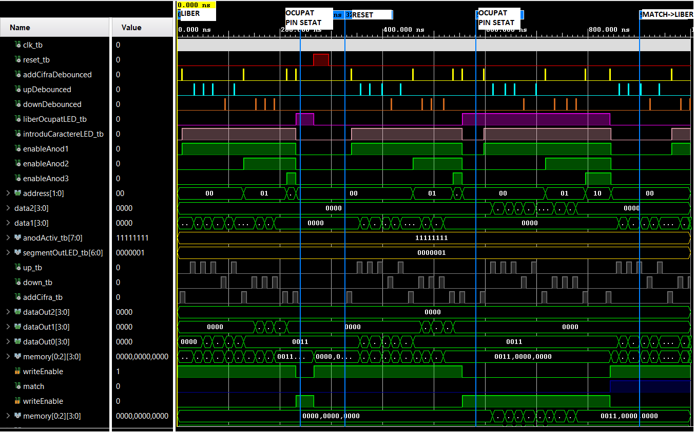

# A digital locker made in Xilinx Vivado using VHDL for the Nexys A7 FPGA
 By Mihai Stoica and Vlad Sarandan
This project was an assignment for the Digital Systems Design(Proiectarea sistemelor numerice) course at UTCN AC CTI first year.

---
# Instructions
- The locker has a "Locked" and "Free" state indicated by the last LED(H17) on the FPGA(on if Locked). 
- To enter a PIN character by character press the Enter(N17) button on the FPGA then the K15 LED will lighten up, indicating that you can enter a character(0 to F) using the Up(M18) / Down(P18) buttons. The current PIN will be displayed on the seven segment displays.
- If the locker is in the "Free" state, as soon as the PIN is set it will be set to "Locked", requiring the same PIN to unlock.
- The J15 switch can be flipped at any time to reset the locker, erasing the PIN and making it "Free".

